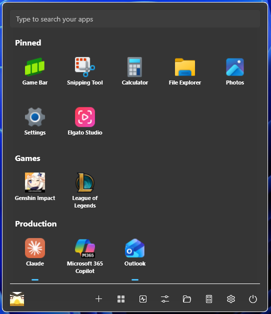
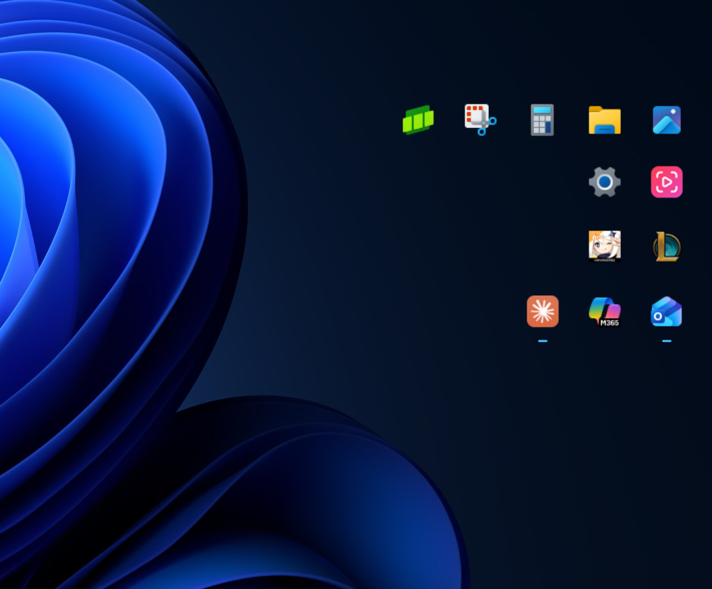
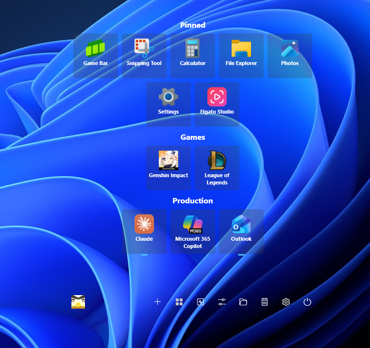
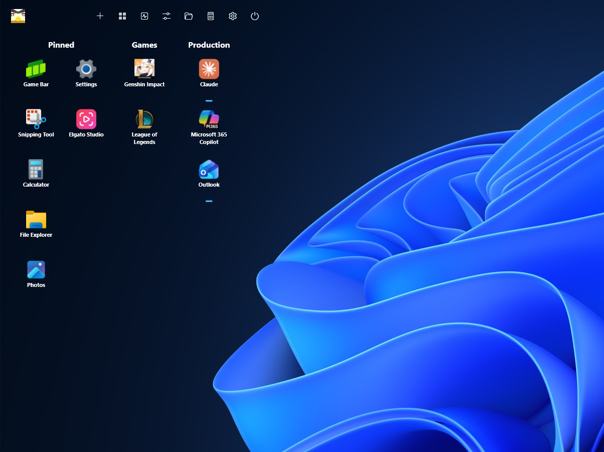
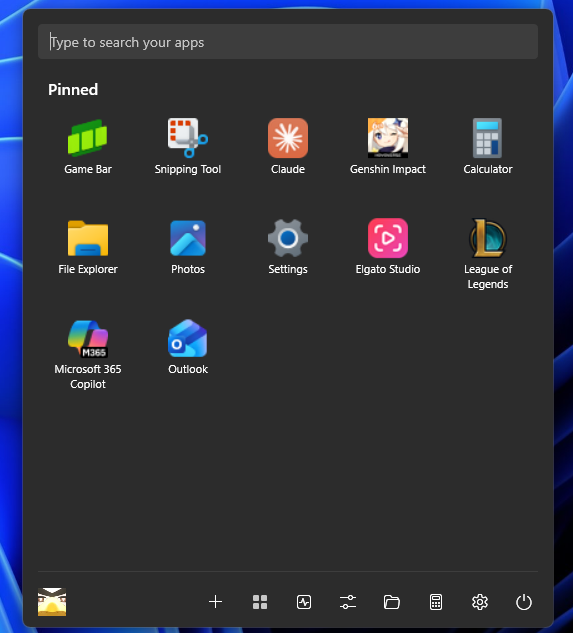
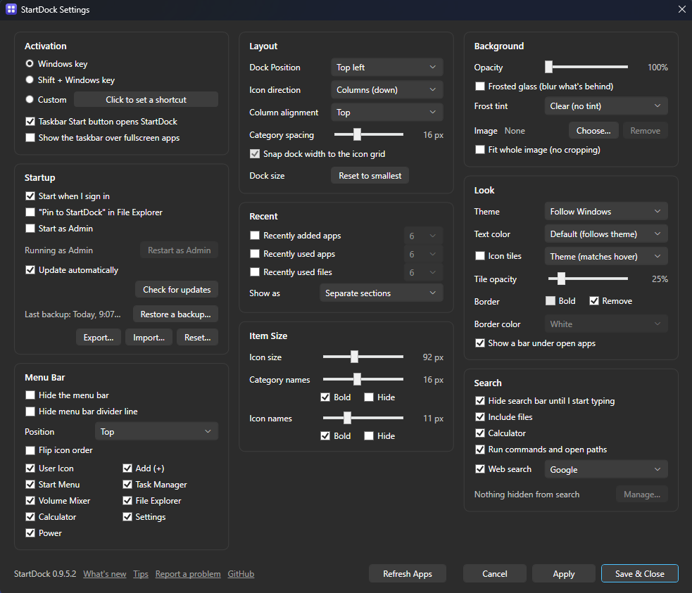

# StartDock

A clean, customizable replacement for the Windows Start menu. No "Recommended"
section, no ads, no apps you didn't ask for: just the apps, folders, files and
websites you pin, arranged the way you like, plus fast search.

Press the **Windows key** (or click the taskbar **Start button**) and StartDock
opens instead of the Windows Start menu.

<p align="center">
  
  &nbsp;
  
</p>

## Download

Get the latest **StartDock-Setup-x.x.x.exe** from the
[Releases page](https://github.com/Kikolado/StartDock/releases/latest) and run it.

- Windows 10 (1809 or later) or Windows 11, 64-bit.
- No administrator rights needed, and nothing else to install first.
- StartDock updates itself: Settings → Startup → **Update automatically**.
- Windows SmartScreen may warn the first time, because StartDock isn't
  code-signed. Click **More info → Run anyway**.

The first time it runs, a short welcome screen lets you pick how StartDock
opens, where it sits on screen and how it looks, and can pin your most used apps
for you.

## Make it look how you want

<table>
  <tr>
    <td></td>
    <td></td>
  </tr>
  <tr>
    <td align="center">See-through, with icon tiles</td>
    <td align="center">Top left, in columns</td>
  </tr>
  <tr>
    <td></td>
    <td></td>
  </tr>
  <tr>
    <td align="center">Simple, dark theme</td>
    <td align="center">Nothing but icons</td>
  </tr>
</table>

- **Where it opens:** any of 9 positions (corners, edges or the middle of the
  screen), in rows or columns, with the icons aligned left, center or right. It
  slides in from its screen edge (up from behind the taskbar at the bottom),
  fades in, or just appears.
- **Look:** light, dark or follow Windows; your own background, text, accent,
  tile and border colors; background opacity from solid to fully see-through;
  frosted glass; your own background picture (GIFs work too); border thin, bold
  or removed.
- **Tiles:** icon size, name size, bold or hidden names and category names,
  optional tiles behind each icon, and a small bar under apps that are open.
- **Menu bar:** top or bottom, choose which buttons it shows, or hide it.

<p align="center">
  
</p>

## Features

**Pinning and organizing**

- Pin apps from the full app list, any file, folder or shortcut, Remote Desktop
  connections (.rdp) and websites (with the site's own icon).
- Drag files, folders or a browser link onto the dock to pin them.
- Optional **Pin to StartDock** in File Explorer's right-click menu.
- Group tiles into **categories** you can rename, reorder and fold away, and
  drop one tile on another to make a **folder**.
- Click a pinned folder (like Downloads) to look inside it right in the dock.
- Right-click an app to see its **recent files**, like on the taskbar.
- Removed something by mistake? **Undo** puts it back.
- Change any tile's name and icon, or open **Properties** to set arguments, a
  "Start in" folder, "Always run as administrator" and search keywords.

**Search**

- Start typing as soon as the dock opens. Search finds your pinned items, every
  installed app, Windows Settings pages and classic tools (Device Manager,
  "Turn Windows features on or off"…), and optionally your files.
- Do math (`125*4`, `15% of 80`), run commands and open paths like the Windows
  Run box (`cmd`, `regedit`, `%AppData%`), or search the web.
- Apps you open most come first. Hide anything you never want to see.

**Getting around quickly**

- Arrow keys move between tiles, Enter opens, F2 renames, Delete removes.
- **Alt+1** to **Alt+9** open the first nine tiles (hold Alt to see the numbers).
- Optional sections for recently added apps, recently used apps and recently
  used files.
- Menu bar shortcuts: your account, the real Windows Start menu, Task Manager,
  Volume Mixer, File Explorer, Calculator, Settings and Power (with "Update and
  restart" when an update is waiting).

**Keeping your setup safe**

- Automatic daily backups of your settings and pins (Settings → Startup →
  **Restore a backup…**).
- **Export…** and **Import…** move your whole setup, icons included, to another
  PC. **Reset…** starts over like a new install.

Settings has a search box, so you can type "border" or "blur" instead of
looking through every card. Not sure where something is? Open **Tips** from the tray icon or the bottom of
Settings. **What's new** lists the changes in each version.

## How it works

Windows doesn't let other apps replace its Start menu, and tools that do it by
patching `explorer.exe` tend to break with Windows updates. StartDock doesn't
touch Explorer at all. It runs as an ordinary app in the system tray and:

1. Notices a Windows key press on its own and opens StartDock instead.
   Shortcuts like Win+D, Win+E or Win+Shift+S keep working as usual.
2. Catches clicks on the taskbar Start button (on every monitor that has one).

Exit StartDock from its tray icon and the Windows key and Start button go back to
normal right away. If you'd rather keep the Windows key for Windows, set
StartDock to open with **Shift + Windows key** or a shortcut of your own.

Your settings and pins are stored in `%AppData%\StartDock`.

## Known limitations

- **Games with anti-cheat and other admin windows:** while a program running as
  administrator has focus, Windows doesn't let normal apps see the Windows key,
  so the Windows Start menu may open instead. If that bothers you, turn on
  Settings → Startup → **Start as Admin** (or **Restart as Admin** for now).
- **Task Manager** often runs as administrator too, so the first Windows key
  press after using it can open the Windows Start menu. The next press works.
- On some Windows 11 setups, taskbars on secondary monitors have no Start button
  for StartDock to catch. The Windows key still works there.

## Uninstalling

Uninstall StartDock from Windows Settings → Apps like any other app. It asks
whether to keep your settings and pins, in case you reinstall later.

To turn it off without uninstalling, right-click the tray icon → **Exit**, and
untick Settings → Startup → **Start when I sign in**.

## Found a problem?

Use **Report a problem** in the tray menu or at the bottom of Settings. It opens
a [GitHub issue](https://github.com/Kikolado/StartDock/issues) with your
StartDock and Windows versions filled in.

## Building from source

You need **Visual Studio 2022** with the **.NET desktop development** workload,
or the **.NET 8 SDK**.

- **Visual Studio:** open `StartDock.sln`, pick the `x64` platform and press F5.
- **Command line:**
  ```
  cd src/StartDock
  dotnet build -c Release -p:Platform=x64
  ```

Exit StartDock (tray icon → Exit) before rebuilding, or the build can't replace
the running `StartDock.exe`.

**Releases:** the version lives only in `<Version>` in
`src/StartDock/StartDock.csproj`, and the notes in `CHANGELOG.md` (shown in the
app as What's new, and used as the GitHub release notes). Double-click
`installer\Publish.cmd` to build the installer on your PC
(`installer\Output\StartDock-Setup-<version>.exe`) and/or publish: it tags the
version and GitHub Actions builds the installer and creates the release.

### Project layout

```
StartDock.sln
CHANGELOG.md                     Release notes (What's new in the app, GitHub release notes)
installer/                       Inno Setup script and Publish.cmd
ci/release.yml                   GitHub Actions release workflow
docs/images/                     Screenshots for this page
src/StartDock/
  App.xaml(.cs)                  Startup, single instance, tray, Explorer pin hand-off
  Models/                        AppConfig (everything in config.json), Category, DockIcon
  Services/
    HotkeyService                Windows key / custom shortcut
    StartButtonOverlayService    Taskbar Start button clicks
    ConfigService                config.json, backups, export/import/reset
    InstalledAppsCache, StartAppsService   The installed app list and icons
    IconExtractor, StaWorker, SiteIcon     Icons for apps, files and websites
    AppLauncher, ShortcutResolver          Opening tiles (arguments, run as admin)
    FileSearchService, Calculator, RunCommand, WindowsSettingsCatalog   Search
    RecentFilesService, AppUsageService, RunningApps    Recent sections, most used, open apps
    ExplorerMenuService          "Pin to StartDock" in File Explorer
    JumpListService              An app's recent files, for its right-click menu
    Updater, Changelog           Updates, What's new, Tips, Report a problem
    ...                          Power, theme, tray, autostart, monitors, Win32 calls
  Views/
    MainWindow                   The dock
    SettingsWindow, WelcomeWindow, WhatsNewWindow
    ...                          Dialogs (Add, Properties, Rename, Restore backup…)
  Resources/                     Light/dark themes, styles, Tips.md, app icon
```
